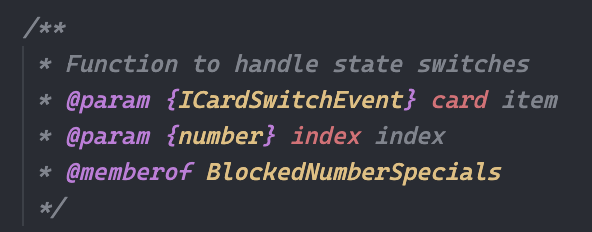

## Documentation

- To define componente should be by the next way:

```
/**
 * description
 * @memberof NameComponent
 */
```

Example:


- To define variables/functions should be by the next way:

```
/**
 * Description
 * @param {interface} card item
 * @memberof NameComponent
 */
```

Example:


