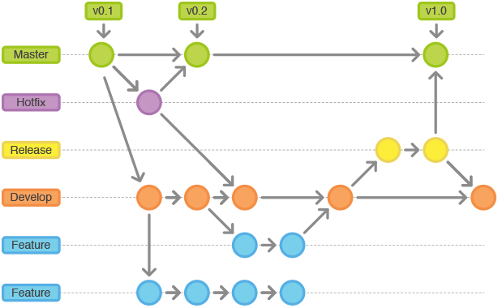

# Git Flow

## Índice

- [Git Flow](#git-flow)
  - [Índice](#índice)
  - [¿Que es GitFlow?](#que-es-gitflow)
  - [Branches](#branches)
    - [GitFlow](#gitflow)

---

## ¿Que es GitFlow?

git-flow is a set of extensions for git that provide high-level commands for operating repositories based on Vincent Driessen's branching model.

In order not to end up in chaos, we must establish “rules of the game” that the entire team must respect. Although in general terms almost all projects can use common base rules, the rules must be flexible to adapt to changes that may arise on the game board; After all, the needs and particularities of each team, company or project are not the same.

And what are these common base rules? In January 2010 [Vincent Driessen](https://nvie.com/about/) published an article on his blog in which he shared with the community a workflow that was working for him: [_A Successful Git Branching Model_ ](https://nvie.com/posts/a-successful-git-branching-model/). As he himself tells in the article (I highly recommend that you read it) Vincent proposes a series of “rules” to organize the team's work.

Therefore, if we want to implement this workflow, every time we want to do something in the code, we will have to create the corresponding branch, work on the code, check in the code where it belongs, and close the branch. Throughout our work day we will need to execute the git, merge, push and pull commands several times a day as well as check out different branches, delete them, etc. Git-flow is a set of extensions that save us a lot of work when executing all these commands, simplifying the management of the branches of our repository.

## Branches

The work is organized into two main sizes:

- **Master branch**: any commit we put in this branch must be ready to go to production.
- **Develop branch**: branch containing the code that will make up the next planned version of the project.

Every time we add new code to master, we have a new version.

In addition to these two branches, the following auxiliary branches are proposed:

- **Feature**: These branches are used to develop new features of the application that, once finished, are incorporated into the develop branch.
  - They originate from the develop branch.
  - They are always incorporated into the develop branch.
  - Name: anything other than master, develop, hotfix-_ or release-_

- **Release**: These branches are used to prepare the next code in production. In these branches the last adjustments are made and the last bugs are corrected before moving the code to production by incorporating it into the master branch.
  - They originate from the develop branch
  - They are incorporated into master and develop
  - Name: release-\*
  - Generates a label in the commit indicating the version generated.
- **Hotfix**: These branches are used to correct errors and bugs in the code in production. They work in a similar way to Releases Branches, the main difference being that hotfixes are not planned.
  - Originates from the master branch
  - They join the master and develop
  - Name: hotfix-\*

### GitFlow

